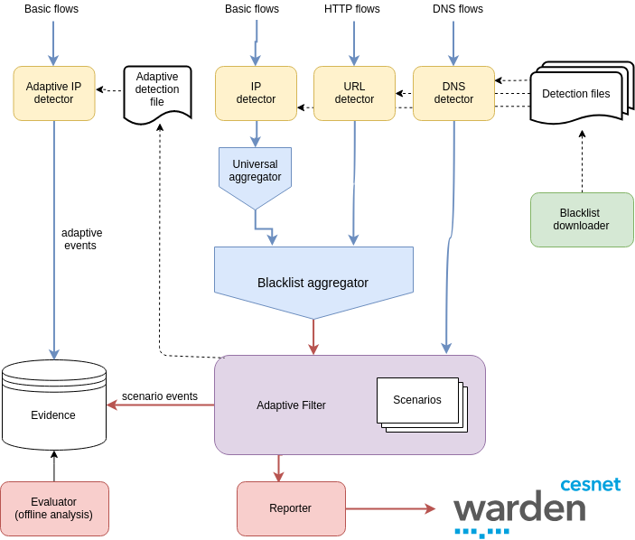

# The blacklistfilter suite

The set of modules named blacklistfilter aims to detect communication with blacklisted entities (from IP/URL/DNS records). 
Besides the basic detection, aggregation and reporting of the suspicious communication, there is also a module called 
`Adaptive Filter` (AF) which is designed to capture another network traffic of the suspicious clients who communicated 
with the blacklisted entity. This traffic is then stored in `Evidence` for further analysis.

Below you can see a diagram of all the modules.

READMEs of the specific modules:
- [IP blacklistfilter (aka IP detector)](ipdetect/README.md)
- [URL blacklistfilter (aka URL detector)](urldetect/README.md)
- [DNS blacklistfilter (aka DNS detector)](dnsdetect/README.md)
- [Blacklist downloader](blacklist_downloader/README.md)
- [Blacklist aggregator](blacklist_aggregator/README.md)
- [Adaptive filter](adaptive_filter/README.md)

## Operation
- The blacklist downloader periodically fetches public blacklists
- Detectors read the blacklist entries and detect communication with them
- Aggregators aggregate the traffic
- Adaptive filter decides whether to report the event, or further analyze clients' traffic
- Reporter reports to Warden

## Configuration
Each module has its configuration parameters or configuratio files (see the READMEs).
When changing the blacklist configuration, it is necessary to restart Adaptive filter, Reporter and Downloader 
(since all read the blacklist config file).