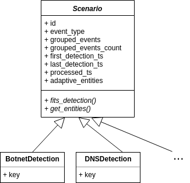
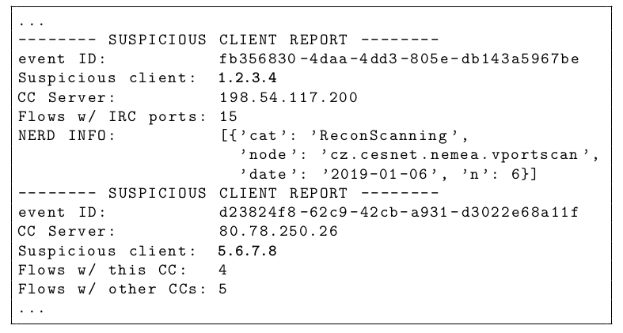

# Adaptive filter

Adaptive filter is the heart of the [blacklistfilter suite](../README.md). It receives all the detected events from
detectors (IP/URL/DNS) and decides whether the detection event will be reported to the Warden, or whether the event
needs further analysis of the suspicious client's traffic (who communicated with blacklisted entity). This is achieved with
so called `scenarios`, where these situations are defined. 


## Usage:

```
Usage:	adaptive_filter -i <trap_interface> [-c <blacklist_config>] [-e <evidence_timeout>] [-p <process_interval>]
                                            [-l <log_level>] [-a <adaptive_blacklist>]
```

- **blacklist_config**: Path to config file of the blacklist downloader (default: /etc/nemea/blacklistfilter/bl_downloader_config.xml)
- **evidence_timeout**: Timeout in seconds, meaning how long shall be the client monitored when the some matches (default: 600)
- **process_interval**: Timeout in seconds, meaning how often the adaptive filter processes new scenario events (default: 30)
- **log_level**: Standard logging level, 10=DEBUG, 20=INFO, etc. (default: 20)
- **adaptive_blacklist**: Path to the adaptive blacklist (default: /tmp/blacklistfilter/adaptive.blist)


## Interfaces
Inputs
   - 0: FMT_JSON - "aggregated_blacklist" - aggregated IP/URL events
   - 1: DNS flows - non-aggregated flows from DNS detector

Outputs
   - 0: FMT_JSON - "aggregated_blacklist" - sending events to Reporter
   - 1: FMT_JSON - "blacklist_evidence" - sending events to Evidence

## Scenarios
The scenarios define what cases trigger further monitoring of clients' traffic.
Every scenario has its defining key and a set of matching conditions. There are 2 scenarios so far.
For future reference, the class is called _scenario_, the instance is then called _scenario event_.
Also, beware the difference between _scenario event_ and _grouped event_.



### Attributes
- ID: UUID of the scenario event
- event_type: Scenario event type (BotnetDetection, DNSDetection, ..)
- grouped_events: A list of the events with the same key (in the same evidence timeout window). E.g. two distinct events
    coming from the blacklist aggregator, where the source of trouble is the same C&C server (BotnetDetection scenario)
- grouped_events_cnt: Count of the grouped events
- first_detections_ts: Timestamp of the first grouped event
- last_detections_ts: Timestamp of the last grouped event
- processed_ts: Timestamp of the last scenario event processing 
- adaptive_entities: Adaptive entities for the scenario event. E.g. a list of IPs who communicated with the C&C


### BotnetDetection
This scenario aims to analyze traffic of the clients who communicated with some C&C server.

Key:
   - IP address of the C&C server
    
Matching conditions:
   - The detection came from the IP/URL interface ("aggregated_blacklist")
   - The detection type is "ip"
   - The blacklist has a category Intrusion.Botnet

### DNSDetection
This scenario aims to catch the DNS queries to blacklisted domains, translate them to IP addresses and then analyze
traffic with these addresses and try to identify the originator of the query. This is necessary because we cannot
report directly the SRC_IP of the DNS query to the blacklisted domain, since the SRC_IP is a recursive DNS resolver.
Key:
    - Domain name
Matching conditions:
    - The detection came from the DNS interface

    
## Operation
### Recieving events
- Adaptive filter listens for detection events from IP/URL detectors (aggregated) and from DNS detector (non-aggregated)
- Upon each received detection event, it is checked against defined scenarios, whether there is a match
- If not, the event is only passed to the Reporter and nothing is stored
- If yes, new `scenario_event` is created or an existing is updated. These scenario events are stored internally

### Processing events
- Every `process_interval`, all the stored scenario events are checked
- Processing event means:
    - Ensuring all the adaptive entities are up to date (when there is a new grouped event)
    - Exporting the scenario event to Evidence when evidence timeout expired
    - Creating new detector file (adaptive blacklist) when any of the above two actions happened (adding/removing entries
    in the adaptive blacklist)
    
### Adaptive IP detector
Adaptive IP detector is a normal IP detector except it uses a different format of the detector file (adaptive_blacklist).
There is also an event ID for each entry. When new detector file is created by the adaptive filter. Adaptive IP detector reloads the entries and starts detection 
(like the normal IP detector). But these detections are then stored in Evidence (see the "Big picture" above).


## Evidence
The Evidence consists of two files:
- `evidence_detection`: All the scenario events stored by the Adaptive filter. Every time the evidence timeout expires for
the current event, this event is exported to this file.
- `evidence_adaptive`: All the adaptive events corresponding to the scenario events. I.e. the traffic of the suspicious clients

The scenario events and adaptive events can be paired using the event ID.

### Evaluation (experimental)
The offline evaluation can be done using the Evaluator script. This script loads the two files and tries to find some
patterns in the communication, these are:
- Flow count of the client and the C&C communication
- Flow count of the client and some other C&Cs communication
- Count of flows with IRC ports
- Information about the client from the [NERD](nerd.cesnet.cz) system


```
Usage:	evaluator.py -i <trap_interface> [-c <blacklist_config>] [-4 <ip4_detector_file>] [-n <nerd_api_key>]
```

#### Example output of Evaluator


