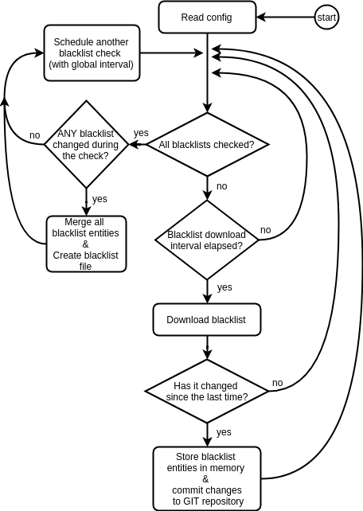

__# Blacklist Downloader

Blacklist Downloader is a python script used to download public blacklists. 
It periodically fetches IP/URL/DNS blacklists, preprocesses them and stores them
in files which can be loaded by the detectors (ipblacklistfilter, urlblacklistfilter, dnsblacklistfilter).
The files for the detectors are specified in a configuration file (bl_downloader_config.xml), 
along with the list of blacklists to download.
   
## How it works

By default, the downloader fetches the blacklists every 10 minutes. If there is an update of some
blacklist, it creates a new file(s) for the detector(s). This file is preprocessed by the downloader, so that
the detector can just read it and start the detection. Preprocessing means: one entity per line,
adding blacklist indexes to the entities, trimming whitespaces, sorting the entities,..

There are 3 types of blacklists: IP/URL/DNS. However, the URL detector also detects DNS names.

## Usage:

```
Usage:	bl_downloader.py [-c <config_file>] [-r <repo_path>] [-l <log_level>]
```

## Configuration
Is done via configuration file (command-line options override config file).
Below is an example config

```xml
<?xml version="1.0" encoding="UTF-8"?>
<configuration>
    <struct name="general">
        <!-- Download interval of all blacklists in minutes -->
        <element name="download_interval">10</element>
        <!-- Socket timeout for requests.get method in seconds -->
        <element name="socket_timeout">5</element>
    </struct>

    <struct name="detector_files">
        <element name="IP4">/tmp/blacklistfilter/ip4.blist</element>
        <element name="IP6">/tmp/blacklistfilter/ip6.blist</element>
        <element name="URL">/tmp/blacklistfilter/url.blist</element>
        <element name="DNS">/tmp/blacklistfilter/dns.blist</element>
    </struct>

    <!-- Array with information about public blacklist -->
    <struct name="blacklist_array">
        <array type="IP">
            <!-- ID of the blacklist, blacklisted flows are flagged with corresponding ID of blacklist
                 BEWARE: Could be number from interval <0, 63> in one group/type -->
            <struct>
                <element name="id">1</element>
                <!--Category of the blacklist, it SHOULD match some of the IDEA categories (idea.cesnet.cz)-->
                <element name="category">Intrusion.Botnet</element>
                <!-- Method of retrieving blacklist -->
                <element name="method">web</element>
                <!-- Name of the blacklist, module uses this name to choose which blacklist to use -->
                <element name="name">Feodo Tracker</element>
                <!-- Address from which the blacklist will be downloaded -->
                <element name="source">https://feodotracker.abuse.ch/downloads/ipblocklist.txt</element>
                <!--Download interval in minutes-->
                <element name="download_interval">10</element>
                <!--Are the blacklist entries IPv4 or IPv6-->
                <element name="ip_version">4</element>
            </struct>
        </array>
        
        <array type="URL/DNS">
            <struct>
                <!-- ID of the blacklist, blacklisted flows are flagged with corresponding ID of blacklist
                     BEWARE: Could be number from interval <0, 63> -->
                <element name="id">1</element>
                <!-- Method of retrieving blacklist -->
                <element name="method">web</element>
                <!-- Name of the blacklist, modules uses this name to choose which blacklist to use -->
                <element name="name">PhishTank</element>
                <!-- Address from which the blacklist will be downloaded -->
                <element name="source">http://data.phishtank.com/data/online-valid.csv</element>
                <!-- OPTIONAL, if specified, module treats the source as .csv file and tries to parse column with this number-->
                <element name="csv_col">2</element>
                <!--Category of the blacklist, it SHOULD match some of the IDEA categories (idea.cesnet.cz)-->
                <element name="category">Fraud.Phishing</element>
                <!-- Download interval in minutes -->
                <element name="download_interval">10</element>
                <!--What detectors should use this blacklist-->
                <element name="detectors">URL,DNS</element>
            </struct>        
        </array>
    </struct>
</configuration>
```

- `repo_path` - path to GIT repo. Provides local versioning of all the blacklists. Upon module startup, if no GIT repo in this path is present, it is created. If the path is present, it continues versoning.
- `log_level` - standard level of logging (to stderr). 20 = INFO, 10 = DEBUG, etc.


## Operation

- Module performs a check of all blacklists every `download_interval` (global/general one)
- Every blacklist can be also fetched at individual `download_interval` (preventing ban)
- The entities are extracted using regexps
- When there is a change in IP or URL/DNS blacklist
    - new detector file is created
    - changes are commited to GIT repo (when -r given) 

Demonstrated also by UML diagram below:



## About detector files

Detector files are special files created by blacklist downloader for the detectors (ip/url/dns). 
Every row contains an entity, separator and blacklist index. All the entities are sorted (especially useful for ip blacklistfilter, which uses binary search). When there is a change in any blacklist of a given type, new detector file is created (rewrites the old one). The detector listens for the file change (inotify's IN_CLOSE_WRITE flag) and reloads the file when
there is a change. The detector doesn't have to process the data, it just loads them and detects. All the preprocessing (sorting, case-insensitivying, ..) is done by the downloader.

The blacklist index is a bitmap, so a value 9 means the entity is present on the blacklists with ID 1 and 4.


### Examples
*/tmp/blacklistfilter/ip4.blist*
```
1.10.16.0/20,8
1.19.0.0/16,8
1.22.124.243,256
1.22.180.84,256
1.22.241.193,256
```

*/tmp/blacklistfilter/ip6.blist*
```
2401:c580:0000:0000:0000:0000:0000:0000/32,256
2402:6680:0000:0000:0000:0000:0000:0000/32,256
2405:b180:0000:0000:0000:0000:0000:0000/32,256
```

*/tmp/blacklistfilter/url.blist*
```
0632qyw.com\1
06642.ir/wp-includes/fonts/chaseonline2019/ch1.1/07b2f33e388cf03a82397b057fb9e03b\4
06works-plus.com\1
071899.com\1
```

*/tmp/blacklistfilter/dns.blist*
```
dorothyn.com\1
dorpk2sa2i.dayzcy3xae.madpendesign.com.au\1
dortxn.com\1
```

## Example module run
```
alois@some_kinda_linux:~$ bl_downloader.py --repo-path /tmp/repicko
[2019-03-27 14:35:22,043] - INFO - Initialized empty Git repository in /tmp/repicko/.git/
[2019-03-27 14:35:22,304] - INFO - Updated IPv4Blacklist: ZeuS Tracker
[2019-03-27 14:35:22,549] - INFO - Updated IPv4Blacklist: Feodo Tracker
[2019-03-27 14:35:22,761] - INFO - Updated IPv4Blacklist: Ransomware Tracker
[2019-03-27 14:35:22,920] - INFO - Updated IPv4Blacklist: Spamhaus Drop
[2019-03-27 14:35:23,036] - INFO - Updated IPv4Blacklist: Andoniaf Miners
[2019-03-27 14:35:24,202] - INFO - Updated IPv4Blacklist: SANS Miners
[2019-03-27 14:35:25,110] - INFO - Updated IPv4Blacklist: Cryptoioc Miners
[2019-03-27 14:35:26,794] - INFO - Updated IPv4Blacklist: CI Army - BadGuys
[2019-03-27 14:35:26,802] - WARNING - IPv4Blacklist, CZ.NIC Honeypot Cowrie: No valid entities found
[2019-03-27 14:35:26,995] - INFO - Updated IPv4Blacklist: CZ.NIC Honeypot Dionaea
[2019-03-27 14:35:27,616] - INFO - Updated IPv4Blacklist: Malc0de
[2019-03-27 14:35:27,938] - INFO - Updated IPv4Blacklist: URLVir
[2019-03-27 14:35:27,984] - INFO - Committed changes to GIT
[2019-03-27 14:35:28,146] - INFO - New IPv4 detector file created: /tmp/blacklistfilter/ip4.blist
[2019-03-27 14:35:28,249] - INFO - Updated IPv6Blacklist: Spamhaus Drop
[2019-03-27 14:35:28,264] - INFO - Committed changes to GIT
[2019-03-27 14:35:28,266] - INFO - New IPv6 detector file created: /tmp/blacklistfilter/ip6.blist
[2019-03-27 14:35:30,231] - INFO - Updated URLandDNSBlacklist: Malware Domains
[2019-03-27 14:35:30,414] - WARNING - Could not fetch blacklist: http://data.phishtank.com/data/online-valid.csv
Status code: 509
[2019-03-27 14:35:31,269] - INFO - Updated URLandDNSBlacklist: OpenPhish
[2019-03-27 14:35:31,854] - INFO - Updated URLandDNSBlacklist: DisconnectMe
[2019-03-27 14:35:32,017] - INFO - Updated URLandDNSBlacklist: Booters
[2019-03-27 14:35:32,321] - INFO - Updated URLandDNSBlacklist: Zeus Tracker
[2019-03-27 14:35:32,560] - INFO - Updated URLandDNSBlacklist: Ransomware Tracker
[2019-03-27 14:35:32,656] - INFO - Committed changes to GIT
[2019-03-27 14:35:32,939] - INFO - New URL detector file created: /tmp/blacklistfilter/url.blist
[2019-03-27 14:35:32,939] - INFO - New DNS detector file created: /tmp/blacklistfilter/dns.blist
```
