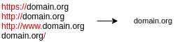

# URL blacklistfilter

This module is a part of the blacklistfilter suite. For information about other modules, see the main [README](../README.md)

## Goal	

Module receives the UniRec HTTP flow records and checks if the HTTP PATH (`HTTP_HOST` + `HTTP_URL`) is present in any 
blacklist that are available. If any of the addresses is 
blacklisted, the record is changed by adding a number/index of 
the blacklists that contain this URL. UniRec with this 
flag is then sent to the output interface. Blacklists are downloaded by a separate module
Blacklist downloader which saves blacklists to a file (specified in configuration) and blacklistfilter uses
this file to reload blacklists.

## Input/Output

```
Input Interface:  UniRec format (<HTTP_FLOW>)
Output Interface: UniRec format (<HTTP_FLOW>,BLACKLIST)
```

## Usage

```
Usage:	urlblacklistfilter -i <trap_interface> [-c <config_file>] [-b <blacklist_file>]
```

## Configuration
Is done via configuration file (command-line options override config file)

```xml
<?xml version="1.0" encoding="UTF-8"?>
<configuration>
    <struct name="main struct">
        <!-- Name of the file with blacklisted URLs.
             These blacklists are meant to be prepared by blacklist downloader.
             -->
        <element name="blacklist_file">
            /tmp/blacklistfilter/url.blist
        </element>
        <!-- When set to true, watch the blacklist file(s) for changes (with inotify mechanism)
        and reload them instantly when there is a blacklist update, false means just to load blacklists at startup
        -->
        <element name="watch_blacklists">
            true
        </element>
    </struct>
</configuration>
```

- `blacklist_file`: An URL file created by Blacklist downloader, containing (sorted) entries from all blacklists

- `watch_blacklists`: A flag indicating whether the blacklist file is being reloaded everytime the file changes. When set to false, 
the blacklists are loaded only once at the startup of the module

## Operation

- Module reports every single flow with URL present on some blacklist
- If `watch_blacklists` flag is true, the module listens for changes (IN_CLOSE_WRITE events) in the file(s) and reloads
them everytime there is a change
- Detection of the URL is case-insensitive and deals with little nuances in the URLs (such as redundant backslashes). Following 
domain names (HTTP_HOST) are treated the same:



## Required data

This module is implemented on TRAP platform, so it receives data on
TRAP input interface in UniRec format.

UniRec fields required:

- `DST_IP` (ipaddr): destination IP address of the flow
- `SRC_IP` (ipaddr): source IP address of the flow
- `DST_PORT` (uint16): destination port of the flow
- `SRC_PORT` (uint16): source port of the flow
- `PROTOCOL` (uint8): protocol used (TCP, UDP...)
- `PACKETS` (uint32): packets in the flow
- `BYTES` (uint32): bytes in the flow
- `TIME_FIRST` (time): time of the first packet in the flow
- `TIME_LAST` (time): time of the last packet in the flow
- `HTTP_REQUEST_HOST` (string): HTTP Host header
- `HTTP_REQUEST_REFERER` (string): HTTP Referer header
- `HTTP_REQUEST_URL` (string): HTTP URL


## Output data

Upon detection, the input data are sent to the output, enriched with this value:

- `BLACKLIST` (uint64): indexes of the blacklists (bitmap) which blacklisted the URL

For example, when the `BLACKLIST` field contains number 9, it means the URL is present on 
blacklists with ID 1 and 4 (in binary: 1001)

## Compilation and linking

This module requires compilation with `-std=c++11`, because of the usage of *std::vector, streams, etc.*.

For linking add `-ltrap -lunirec -lnemea-common`
(the module must be compiled as a part of [NEMEA](https://github.com/CESNET/Nemea) repository or using installed libtrap-devel and unirec packages).


## Example detection
Below is an example output of this detector. IP addresses are made-up.
When dealing with HTTPS, only domain name is visible to the module (through SNI header during TLS handshake), 
so only domain names can be blacklisted when using HTTPS. With HTTP it can be either a domain or the entire URL.

```
ipaddr DST_IP,ipaddr SRC_IP,uint64 BLACKLIST,uint64 BYTES,time TIME_FIRST,time TIME_LAST,uint32 PACKETS,uint16 DST_PORT,uint16 SRC_PORT,uint8 PROTOCOL,string HTTP_REQUEST_HOST,string HTTP
_REQUEST_REFERER,string HTTP_REQUEST_URL

192.168.1.1,192.168.1.2,8,3331,2018-09-11T10:16:54.549,2018-09-11T10:18:24.750,19,443,54174,6,"e.mail.ru","",""
192.168.1.1,192.168.1.2,4,450,2018-09-16T23:05:56.197,2018-09-16T23:05:57.481,6,80,48196,6,"112.e-democracy.bg","","/fre/verification/15d0e09cmbmm1b38nm5n/access.php"
192.168.1.1,192.168.1.2,17,446,2018-09-16T23:08:45.119,2018-09-16T23:08:45.837,7,80,48910,6,"029999.com","","/"
192.168.1.1,192.168.1.2,4,465,2018-09-16T23:09:37.086,2018-09-16T23:09:37.662,6,80,56802,6,"ang.angelflightmidatlantic.org","","/~mercymed/wp-content/uploads/2011/image/dhl/dhl/dhl"
```
