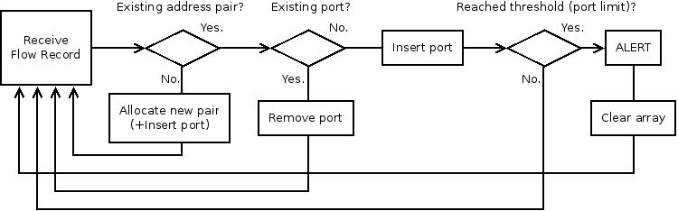

# Vportscan detector

Vportscan detector is a simple, threshold-based detector for vertical
scans detection. The detection algorithm uses information from basic
flow records (source and destination IP addresses and ports, protocol,
#packets, #bytes).

The detection algorithm is based on analysis of the number of
destination ports per source address. It is important to remember all
unique destination ports for each pair of source and destination
addresses separately. The source address is a potential source of
scan, meanwhile, the destination address is a victim.

The input of algorithm are all incoming flow records, however, only
the flow records that satisfy a condition are processed. The condition
contains transport protocol (must be TCP), the number of packets in a
flow (must be lower or equal to 4), TCP flags (must be equal to SYN).
If the destination port is not yet stored in the list of seen ports of
the pair of addresses, the port is normally added. Otherwise, the port
is completely removed from the set due to the following assumption. We
assume that repeating destination port belongs to benign traffic
because there is generally no reason to scan one port repeatedly from
one source address. If the list of seen ports of a pair of addresses
contains 50 unique ports, an alert is reported.

## Thresholds used by the algorithm

1. **Maximal number of packets per flow**. Flows with more the 4
   packets are rather a normal communication with data transfer. Size
   of packets is not considered at all since scanning tools may
   generate packets with any size.

2. **Maximal number of destination ports per source&destination
   address pair**. After reaching this threshold set to 50, an alert
   is generated. The threshold affects memory consumption, detection
   delay and number of possibly undetectable scans (if a scanner
   probes less than 50 ports, the scan remains undetected). It is
   important that the value of this threshold has no relation to time
   as it is used in other existing detection algorithm (e.g. number of
   ports per time window).

3. **Maximal age of unmodified list of ports**. This threshold is set
   to 5 minutes. It defines the slowest scan that the detection
   algorithm is able to detect. The chosen value is related to the
   slowest time template of nmap (-T0). This means one port is probed
   every 5 minutes. Theoretically, all ports would be scanned in about
   227 days at this speed. From the practical point of view, it makes
   no sense to increase this threshold.

## Diagram of the algorithm

The threshold 1 (number of packets) is checked immediately when a flow
record is received. The source and destination addresses are used as a
key to find the stored list of ports. If the pair of addresses is not
known, a new list of ports is allocated, the current destination port
is inserted into the list and the algorithm continues with the next
flow record. Otherwise, the destination port from the flow record is
looked up in the found list of ports. If the port is found it is
removed (it is a repeating port), otherwise, it is inserted. Reaching
the threshold 2 (number of stored ports) generates an alert. Finally,
the threshold 3 (age of inactivity) is used for cleaning memory once
every minute.

## Output data

In case some source IP address reaches the threshold 50 for number of
destination ports, an alert is sent via output interface. The alert is
in Unirec format and it contains the following information:

| Unirec field | Description                        |
|:------------:|:----------------------------------:|
| EVENT_TYPE   | type of event (1 for scanning)     |
| TIME_FIRST   | first time stamp                   |
| TIME_LAST    | last time stamp                    |
| SRC_IP       | IP address of the attacker         |
| DST_IP       | IP address of the victim           |
| SRC_PORT     | last src port used by the attacker |
| DST_PORT     | last dst port used by the attacker |
| PROTOCOL     | transport protocol (TCP)           |
| PORT_CNT     | number of probed destination ports |
